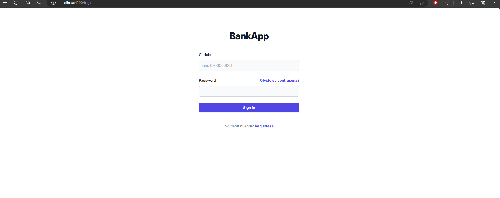
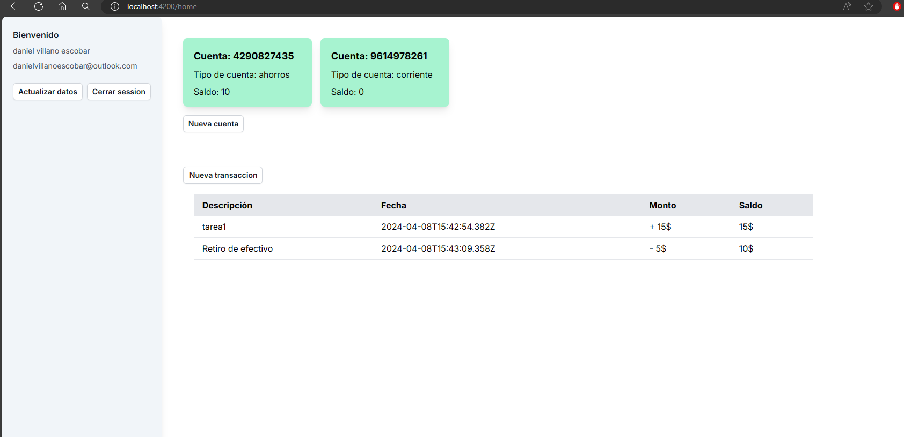

Login

Pagina de inicio

# BancoFrond

BancoFrond es una aplicación web desarrollada con Angular que permite a los usuarios gestionar sus cuentas bancarias y movimientos.

## Características

- Gestión de cuentas bancarias: los usuarios pueden crear, editar y eliminar cuentas.
- Gestión de movimientos: los usuarios pueden ver los movimientos de cada cuenta y añadir nuevos movimientos.

## Tecnologías utilizadas

- Angular
- Angular CLI
- RxJS
- Tailwind CSS

## Instalación y uso

1. Clona el repositorio: `git clone https://github.com/usuario/BancoFrond.git`
2. Navega al directorio del proyecto: `cd BancoFrond`
3. Instala las dependencias: `npm install`
4. Inicia el servidor de desarrollo: `ng serve`
5. Abre un navegador y navega a `http://localhost:4200/`

## Pruebas

Para ejecutar las pruebas unitarias, utiliza el comando `ng test`.

Para ejecutar las pruebas de extremo a extremo, utiliza el comando `ng e2e`.

## Contribuir

Si quieres contribuir al proyecto, por favor, crea una issue explicando el cambio que quieres hacer o directamente un pull request con tus cambios.

## Licencia

Este proyecto está bajo la licencia MIT. Consulta el archivo `LICENSE` para más detalles.